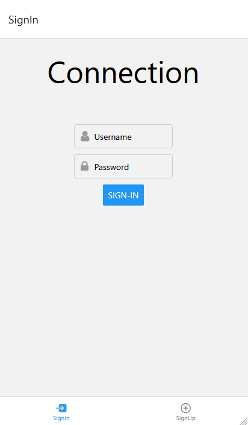
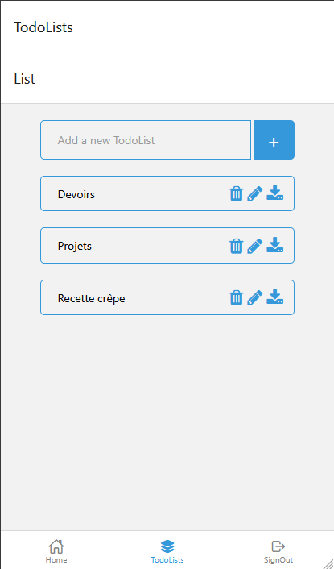
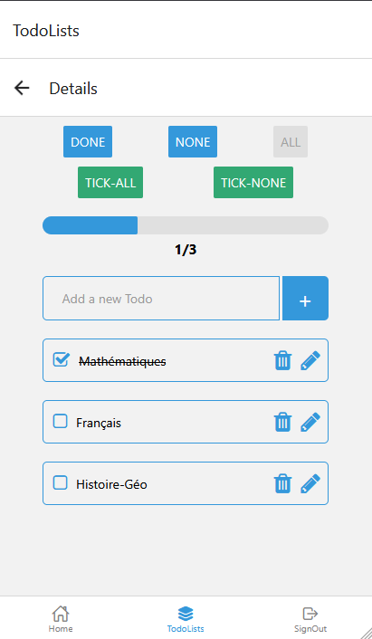

# Application Todo-List

## Description

J'ai développé une application multi-plateforme en React Native permettant de gérer diverses listes de tâches. 
J'ai opté pour Neo4j comme base de données, couplée à GraphQL pour découvrir et apprendre à utliser de nouveaux outils.
Apollo Server a été utilisé pour le déploiement de l'API, et Expo pour simplifier le lancement l'application.

## Prérequis

+ Installation de [Node.js](https://nodejs.org/en/download)
    + Normalement l'installation de `npm` et `npx` est comprise dans celle de Node.js

+ Installation de [Neo4j](https://neo4j.com/docs/operations-manual/current/installation/)
    + Neo4j fonctionne avec [JDK 21](https://www.oracle.com/fr/java/technologies/downloads/#java21)
    + Installation du plugin [APOC](https://neo4j.com/docs/apoc/current/installation/)

## Comment lancer l'application

### Démarrer l'API GraphQL

+ Se rendre dans le dossier `./src/graphql-app/`

+ Mettez à jour le fichier `.env`

+ Installation des dépendances nécessaires au projet avec la commande `npm install`

+ La commande ``npm start` permet de lancer le serveur Apollo

### Démarrer l'Application React Native

+ Se rendre dans le dossier `./src/graphql-app/`

+ Installation d'Expo CLI avec la commande`npm install -g expo-cli`

+ Installation des dépendances nécessaires au projet avec la commande `npm install`

+ La commande `npm start` permet de lancer l'application Todo-List.

## Contribuer

+ N'hésitez pas à signaler des bugs.

+ N'hésitez pas à améliorer le code existant.

## Licence

Ce projet est sous licence [MIT](./LICENSE.md).

## Captures d'écran

